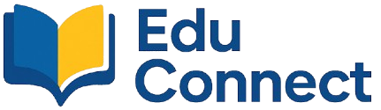

# EduConnect Landing Page

Official landing page for **EduConnect**, built to showcase our brand, educational services, and digital learning solutions.

## Overview

This project is a responsive marketing website focused on:

- Brand presentation
- Educational service promotion
- Student and institution engagement
- Lead generation
- Modern UI/UX experience
- Accessible learning-focused design

## Features

- Responsive design across devices
- Animated interactions and transitions
- Modern component-based UI
- SEO-friendly structure
- Accessibility-focused components
- Contact / inquiry forms
- Dark mode support, if applicable
- Clear service and program presentation
- User-friendly navigation for students, parents, and educators

## Tech Stack

### Frontend

### UI & Styling

---
 